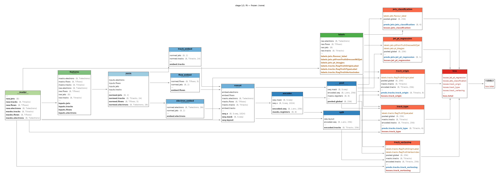
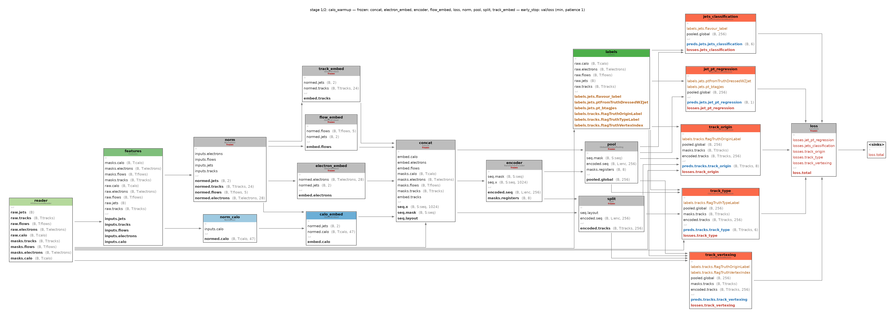
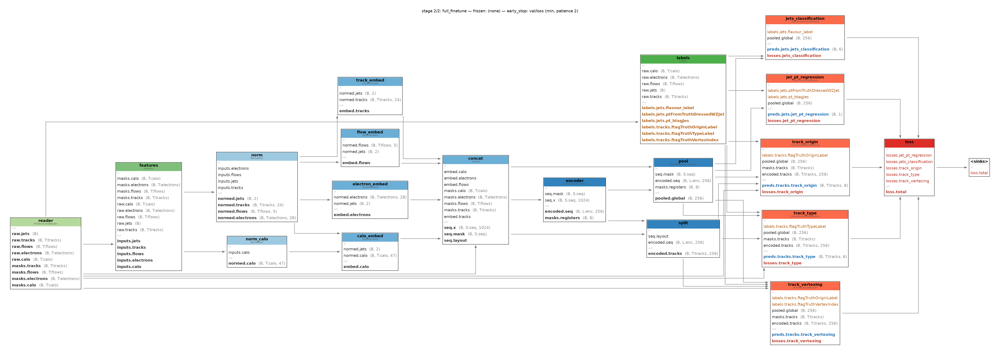
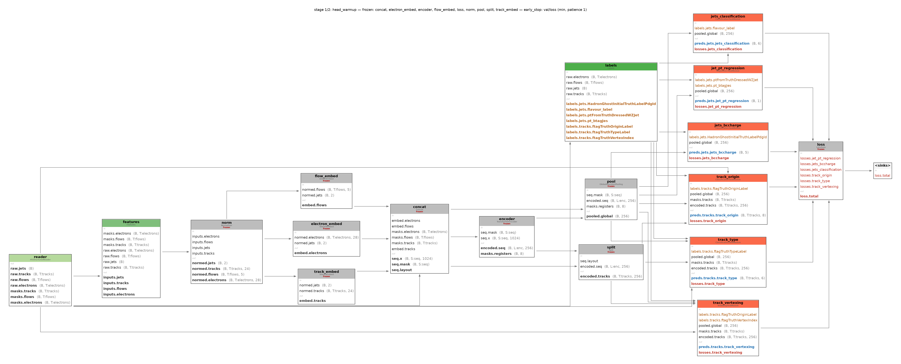
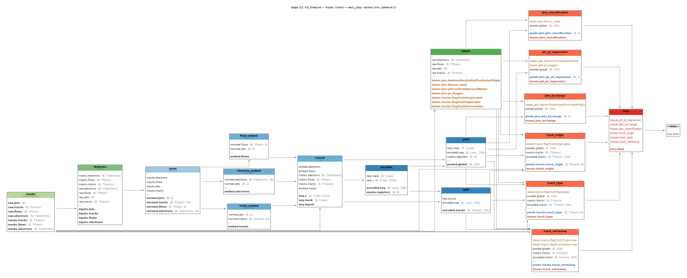
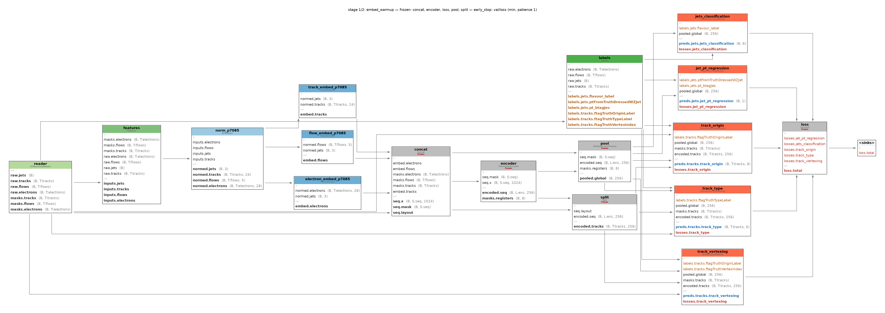
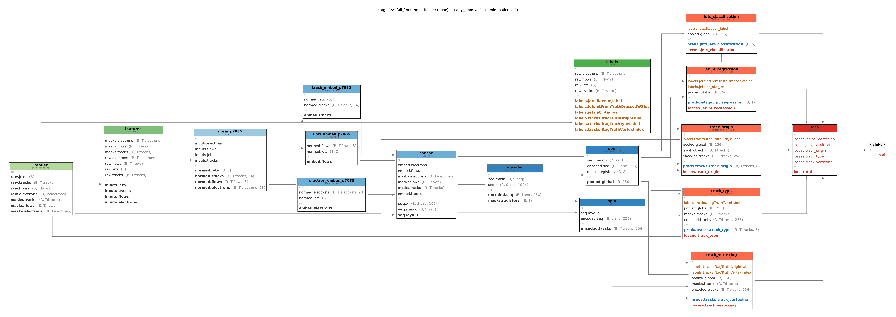
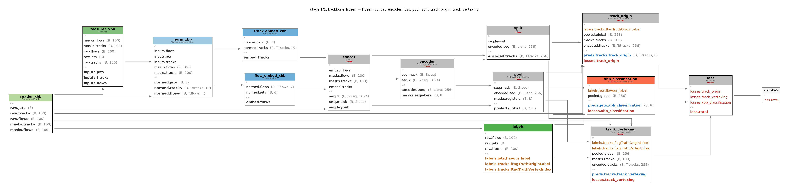
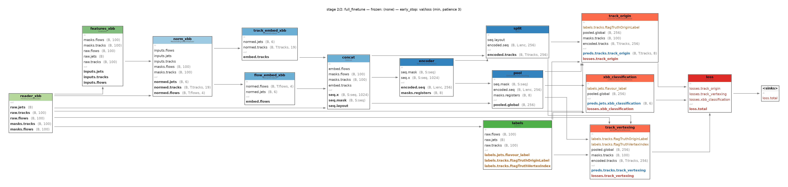

# Fine-tuning a pretrained tagger

The earlier tutorials trained models from scratch. This one starts from a **pretrained
checkpoint** and adapts it, the everyday situation when a new MC campaign lands, a specialised
topology needs its own tagger, or you want to bolt a new task head onto an existing backbone
without paying for a full retrain.

Salt gives you two independent tools for this: **`--init_from`**, a weights-only warm start that
seeds a fresh run's weights from a checkpoint module by module, and **`training_schedule:`**, a
staged training plan that freezes part of the network for some epochs then unfreezes it, each
stage at its own learning rate. Both are covered in full on the [Fine-tuning reference
page](../finetuning.md); this tutorial walks through four worked examples that use them.

**GN3Large** (86 M parameters, 11 parameter-bearing modules) is the pretrained model throughout.
Worked examples 1–3 fine-tune it on the **p7085** FTAG training sample, the same production
family GN3Large was trained on, so every variable the bundle's config reads is present and its 6
ghost classes match `class_names` exactly. Worked example 4 moves it to the boosted-Xbb sample
from [Boosted Xbb tagging](xbb.md), a domain shift.

Fine-tuning is mostly about reusing the pretrained **backbone**: the encoder and pooling layer
that turn a bag of tokens into a jet embedding. The task heads and the input embeddings that feed
them are comparatively cheap: swapping them for fresh ones is not a workaround, it is most of
what "fine-tuning" means here. This page walks that up in four steps, each changing **exactly one
thing** about the bundle so the cost of that one change is visible on its own: (1) add an input
stream, (2) add a task head, (3) add variables to an existing collection, then (4), once you have
felt each cost in isolation, the everyday case, a full backbone transfer to a different domain
that changes several things at once.

## Prerequisites

You need salt installed ([Setup](../setup.md)) and should be comfortable with the
config structure from [part 1](mnist.md) (the `model.modules` dict, task heads,
`class_path` wiring). The container notes from [part 1](mnist.md#prerequisites)
apply unchanged.

**You need a CERN account.** The pretrained bundle and both target datasets live
on CERN EOS and are copied with `xrdcp`, which needs a valid Kerberos ticket:

```bash
kinit USER@CERN.CH   # USER = your CERN username; klist should then show a krbtgt/CERN.CH ticket
```

On lxplus you already have one. Off-site you need the `xrootd` client and
`krb5` configured for the `CERN.CH` realm, nothing else.

### Set up your fine-tuning directory

```bash
export SALT=/path/to/your/salt/checkout        # the one placeholder on this page
mkdir my-finetune && cd my-finetune            # any name you like; every command below runs from here
for d in gn3large_model xbb-finetune ftag-finetune; do   # CERN account; ~18.5 GB total
  xrdcp -r root://eosuser.cern.ch//eos/user/n/npond/salt-data/finetuning/$d/ .
done
mkdir -p configs logs
cp -r $SALT/docs/tutorials/configs/finetuning/. configs/   # your editable copies of the shipped base + overlays + norm_dicts/
ls
```

```text
configs/  ftag-finetune/  gn3large_model/  logs/  xbb-finetune/

gn3large_model/
  config_v2.yaml
  converted.ckpt
  norm_dict_v2.yaml
xbb-finetune/
  pp_output_train_small.h5
  pp_output_val-full_0_100k.h5
  pp_output_test-full_0_100k.h5
ftag-finetune/p7085/
  pp_output_train_260331_split_127.h5
  pp_output_val_260331_split_003.h5
  pp_output_test_ttbar_260331_split_002.h5
  pp_output_test_zprime_260331_split_001.h5
  class_dict_260331.yaml
  ghost-highstat_260331.yaml
  norm_dict_260331.yaml
  SHA256SUMS
configs/
  gn3large_base.yaml
  finetune_gn3large_add_calo.yaml
  finetune_gn3large_add_charge_head.yaml
  finetune_gn3large_add_jet_vars.yaml
  finetune_gn3large_xbb_transfer.yaml
  norm_dicts/
logs/
```

`xrdcp -r <folder>/ .` lands the folder by its own name in the current directory, which is why the
loop above runs from inside `my-finetune/`; pointing `xrdcp -r` at a destination that does not yet
exist is refused.

**Every command on this page is run from `my-finetune/`.** Two more placeholders are used from
here on, both run-output rather than environment variables: **`<run_dir>`**: the directory `salt
fit` prints at the end (`salt fit artifacts: config.yaml in …`), under `logs/<example>/` once you
pass `--trainer.default_root_dir` set to `logs/<example>` as every worked example below does, and
**`<best val/loss ckpt>`**: a file in that run's `ckpts/`, selected by validation loss, not the
last epoch.

| Folder | Contents | Used by |
|---|---|---|
| `gn3large_model/` | the pretrained GN3Large bundle: `converted.ckpt` (345 MB), `config_v2.yaml`, `norm_dict_v2.yaml` | every example |
| `ftag-finetune/p7085/` | p7085 FTAG training sample: train `split_127` (~3 M jets), val `split_003` (~850 k), test ttbar `split_002` / Z' `split_001`, `norm_dict_260331.yaml`, `class_dict_260331.yaml`, `ghost-highstat_260331.yaml`, `SHA256SUMS` | worked examples 1–3 |
| `xbb-finetune/` | boosted-Xbb triple, 100 k jets each: `pp_output_train_small.h5`, `pp_output_val-full_0_100k.h5`, `pp_output_test-full_0_100k.h5` (schema: [Boosted Xbb tagging §1](xbb.md#1-get-the-data)) | worked example 4 |

`gn3large_model/config_v2.yaml` sets `norm_dict: norm_dict_v2.yaml`, relative to the current
directory rather than the config's location. Every FTAG example therefore passes
`--model.init_args.modules.norm.init_args.norm_dict=gn3large_model/norm_dict_v2.yaml`, except
[worked example 3](#worked-example-3-add-variables-to-an-existing-collection), which deletes
`norm` entirely. The copied overlays' own `norm_dict: norm_dicts/…` entries are also relative to
the current directory and are overridden the same way, with `configs/norm_dicts/<file>.yaml`.

Three files are used:

- **Train**: `ftag-finetune/p7085/pp_output_train_260331_split_127.h5`, only
  the first **1,000,000 jets** (`input_samples.num.train: 1000000`; the file
  has ~3 M, UPP output is pre-shuffled, so a prefix is a fair sample).
- **Validation**: `ftag-finetune/p7085/pp_output_val_260331_split_003.h5`,
  the first **200,000** jets **per epoch** (`num.val: 200000`).
- **Test**: the **same file**, evaluated **in full**. Val doubles as test
  for now. A disjoint `pp_output_test_ttbar_260331_split_002.h5` exists for
  when real test statistics (independent of anything seen during validation)
  are wanted; it is not used for the numbers quoted on this page.

## The model you start from

Before changing anything, look at what you are starting from. `salt
merge-config` takes the same arguments as `salt fit` and, without instantiating
a trainer, reading data, or loading a checkpoint, writes the fully-merged config
plus one freeze-graph PNG per stage:

```bash
salt merge-config \
  --config configs/gn3large_base.yaml \
  --merged.output logs/merge-preview/gn3large.yaml
```

With **no overlay**, the merged schedule is a single implicit `fit` stage:
everything trainable, nothing frozen:



Every worked example below edits this same map. In data-flow order:

| Module | Class | What it does |
|---|---|---|
| *(input)* `jets` | — | 2 variables (`pt_btagJes`, `eta_btagJes`), one vector per jet (`global_object: true`) |
| *(input)* `tracks` | — | 24 variables, up to 50 per jet, h5 dataset `tracks_ghost` |
| *(input)* `flows` | — | 5 variables, up to 50 per jet |
| *(input)* `electrons` | — | 28 variables, up to 10 per jet |
| `norm` | `Normaliser` | normalises all four streams against `norm_dict_v2.yaml`, `global_object: jets` |
| `track_embed` | `StreamEmbed` | embeds normalised tracks to width 1024, `context: [normed.jets]` |
| `flow_embed` | `StreamEmbed` | embeds normalised flows to width 1024, same context |
| `electron_embed` | `StreamEmbed` | embeds normalised electrons to width 1024, same context |
| `concat` *(param-free)* | `Concat` | concatenates the three token streams `[tracks, flows, electrons]` into one sequence |
| `encoder` | `TransformerEncoder` | 8-layer transformer, width 1024, output width 256 |
| `split` *(param-free)* | `Split` | splits the encoded sequence back into its per-stream token slices (`[tracks]`, by position) |
| `pool` | `GlobalAttentionPooling` | attention-pools the encoded sequence to one 256-wide jet embedding, `pooled.global` |
| `jets_classification` | `ClassificationTaskModule` | 6-class ghost `flavour_label` from `pooled.global` |
| `track_origin` | `ClassificationTaskModule` | 8-class `ftagTruthOriginLabel`, per track |
| `track_vertexing` | `VertexingTaskModule` | secondary-vertex association, per track |
| `track_type` | `ClassificationTaskModule` | 6-class `ftagTruthTypeLabel`, per track |
| `jet_pt_regression` | `RegressionTaskModule` | regresses `ptFromTruthDressedWZJet` against `pt_btagJes` |
| `loss` *(param-free)* | `LossSum` | sums the five task losses |

**11 modules carry parameters** (everything above except `concat`, `split`, and
`loss`): this is exactly the count `--init_from`'s accounting works against.
Every worked example below adds to, or reshapes, some subset of this map; none
of them touches `encoder`, and only [worked example 4](#worked-example-4-backbone-transfer-to-boosted-xbb)
touches `pool`.

## Worked example 1 — add the calo stream

The smallest possible change: add ONE new input stream, `calo`, and change
nothing else. p7085 carries a `calo` group the bundle does not read: 47
cluster-level variables, up to 50 clusters per jet. The bundle's own
`norm_dict_v2.yaml` has no `calo` group at all, so the fix is not to extend
`norm` but to add a **second** normaliser that covers only the new stream,
alongside the loaded one.

### The overlay

Shipped as **`docs/tutorials/configs/finetuning/finetune_gn3large_add_calo.yaml`** (your
copy is `configs/finetune_gn3large_add_calo.yaml`), stacked directly on
`gn3large_base.yaml` (or the bundle's own `config_v2.yaml`):

```yaml
data:
  modules:
    reader:
      init_args:
        groups:
          calo: {global_object: false}   # dict key ADDED by deep-merge; dataset name == stream name for calo
    features:
      init_args:
        variables:
          # 47 cluster-level variables, in h5 order (must match the key order
          # of norm_dicts/norm_dict_p7085_calo.yaml)
          calo: [usedInChargedFlow, ENG_BAD_CELLS, ISOLATION, CENTER_MAG, CELL_SIGNIFICANCE,
                 ENG_FRAC_MAX, LATERAL, SIGNIFICANCE, LONGITUDINAL, ENG_POS, EM_PROBABILITY,
                 CENTER_LAMBDA, SECOND_LAMBDA, FIRST_ENG_DENS, SECOND_R, AVG_LAR_Q, MASS,
                 rawPhi, calPhi, rawEta, calEta, rawE, calE, PreSamplerB, EMB1, EMB2, EMB3,
                 PreSamplerE, EME1, EME2, EME3, HEC0, HEC1, HEC2, HEC3, TileBar0, TileBar1,
                 TileBar2, TileGap1, TileGap2, TileGap3, TileExt0, TileExt1, TileExt2,
                 FCAL0, FCAL1, FCAL2]

model:
  init_args:
    modules:
      norm_calo:                       # a SECOND normaliser — only ITS streams get normed.<stream>
        class_path: salt.model.modules.Normaliser
        init_args: {norm_dict: norm_dicts/norm_dict_p7085_calo.yaml, streams: [calo]}
      calo_embed:
        class_path: salt.model.modules.StreamEmbed
        init_args: {stream: calo, context: [normed.jets], out_dim: 1024, dense: {hidden_layers: [512], activation: SiLU}}
      concat:
        init_args: {streams: [tracks, flows, electrons, calo]}   # list REPLACES: calo appended LAST

outputs:
  onnx_export:
    init_args:
      inputs:                          # list REPLACES: the base's four entries restated, then the fifth appended
        - {port: inputs.jets, name: jets_features}
        - {port: inputs.tracks, name: tracks_features, sequence: true, dyn_axis: n_tracks}
        - {port: inputs.flows, name: flows_features, sequence: true, dyn_axis: n_flows}
        - {port: inputs.electrons, name: electrons_features, sequence: true, dyn_axis: n_electrons}
        - {port: inputs.calo, name: calo_features, sequence: true, dyn_axis: n_calo}
```

Every edit here is either a clean add or a full restatement of a list:

- **`reader.groups.calo`** and **`features.variables.calo`** are new dict
  *keys*: a stacked config deep-merges dicts key by key, so adding a key
  never disturbs the three existing streams. (Only *deleting* a key needs the
  `null`-and-rename idiom described in [What `--init_from` accounts
  for](../finetuning.md#what-init_from-accounts-for); nothing here is
  deleted.)
- **`norm_calo`** is a separate `Normaliser`, not an edit to `norm`. A
  `Normaliser` only produces `normed.<stream>` for the streams it is
  configured with, so a second instance with `streams: [calo]` coexists with
  the bundle's `norm` (still covering `jets`/`tracks`/`flows`/`electrons`,
  unchanged) without any conflict or rename. This is *why* example 1 is the
  cheapest of the three FTAG examples: nothing already loaded is touched.
- **`calo_embed`** is a plain `StreamEmbed`, exactly like the three that
  already exist, embedding `calo` to the same `out_dim: 1024` the `Concat`
  step requires.
- **`concat.init_args.streams`** must be **restated in full**. `Concat`'s
  stream list is a plain list, and lists **replace** on merge rather than
  deep-merging element by element; `calo` is appended **last**: `Split` takes
  `tracks` back out of the encoded sequence **by position**, so anything that
  changes where `tracks` sits in the list would break it. Appending new
  streams at the end keeps every existing stream's position fixed.
- **`onnx_export.inputs`** is a list too, so it is restated with the base's
  four entries verbatim plus a fifth `inputs.calo` port.
- The p7085 sample's own `norm_dict_260331.yaml` would work equally well as
  `norm_calo`'s dict: its `calo:` group is byte-identical to the shipped
  `norm_dicts/norm_dict_p7085_calo.yaml` (your copy: `configs/norm_dicts/norm_dict_p7085_calo.yaml`,
  the file the `salt fit` command below actually passes;
  `Normaliser.preflight` only requires the configured streams/variables to be
  present, and ignores extra groups in the dict). The shipped file is a
  small, self-contained copy so the overlay does not depend on an external
  sample file just to parse.
- `name:` is **not** overridden: pre- and post-fine-tune eval columns must
  line up with the base's `GN4_big`, and this overlay changes only the input
  side, not the task.

### The accounting

`--init_from` reports one line per module, in the exact format
`SaltModule._warm_start_summary` writes it. This is the **expected** shape:
the verbatim log lines are filled in from the real run:

```text
  loaded   norm
  loaded   track_embed
  loaded   flow_embed
  loaded   electron_embed
  loaded   encoder
  loaded   pool
  loaded   jets_classification
  loaded   track_origin
  loaded   track_vertexing
  loaded   track_type
  loaded   jet_pt_regression
  new      norm_calo             (fresh init + materialise)
  new      calo_embed            (fresh init + materialise)
```

**11 loaded / 2 new / 0 dropped.** Every module that already existed is still
shape-compatible and loads unchanged; nothing is removed. This is the cheapest
of the three FTAG examples for exactly the reason above: adding a *whole new
stream* costs only that stream's own normaliser and embed.

### The schedule

```yaml
training_schedule:
  stages:
    calo_warmup:            # only the two NEW modules + every task head train
      epochs: 3
      trainable: [norm_calo, calo_embed, jets_classification, track_origin, track_vertexing, track_type, jet_pt_regression]
      lrs: {max: 1.0e-4}
      early_stop: {monitor: val/loss, mode: min, patience: 1}
    full_finetune:
      frozen: []
      lrs: {initial: 1.0e-7, max: 1.0e-5}
      early_stop: {monitor: val/loss, mode: min, patience: 2}

trainer:
  max_epochs: 8
  precision: 16-mixed
```

This is a [`training_schedule:`](../finetuning.md#the-training_schedule-schema)
with two stages, each protected by
[`early_stop`](../finetuning.md#per-stage-early-stopping-early_stop):
`calo_warmup` trains only the two new modules (`norm_calo`, `calo_embed`)
plus every task head, leaving the rest of the backbone frozen, and
`full_finetune` then unfreezes everything at a much gentler LR.

### Previewing the merge

```bash
salt merge-config \
  --config configs/gn3large_base.yaml \
  --config configs/finetune_gn3large_add_calo.yaml \
  --merged.output logs/merge-preview/merged_calo.yaml
```




All nine freeze graphs on this page (the plain graph above, and two per
worked example below) regenerate together with:

```bash
(cd $SALT && bash docs/tutorials/finetuning_render_graphs.sh)
```

### Running it

Both `norm_dict` overrides are needed because both paths are relative to the
**current directory** (`my-finetune/`), not to each other:

```bash
salt fit \
  --config gn3large_model/config_v2.yaml \
  --config configs/finetune_gn3large_add_calo.yaml \
  --init_from gn3large_model/converted.ckpt \
  --model.init_args.modules.norm.init_args.norm_dict=gn3large_model/norm_dict_v2.yaml \
  --model.init_args.modules.norm_calo.init_args.norm_dict=configs/norm_dicts/norm_dict_p7085_calo.yaml \
  --data.modules.input_samples.init_args.files.train=ftag-finetune/p7085/pp_output_train_260331_split_127.h5 \
  --data.modules.input_samples.init_args.files.val=ftag-finetune/p7085/pp_output_val_260331_split_003.h5 \
  --data.modules.input_samples.init_args.num.train=1000000 \
  --data.modules.input_samples.init_args.num.val=200000 \
  --trainer.default_root_dir logs/01_add_calo
```

Then evaluate the best-`val/loss` checkpoint on the full test split:

```bash
salt test \
  --config <run_dir>/config.yaml \
  --ckpt_path <best val/loss ckpt> \
  --data.modules.input_samples.init_args.files.test=ftag-finetune/p7085/pp_output_val_260331_split_003.h5
```

### Reading the evidence

See [Reading the evidence](../finetuning.md#reading-the-evidence) for what
these checks mean in general; below are the actual numbers for this run.

**1. The trainable-parameter jump at the boundary.** In `calo_warmup` only
`norm_calo`, `calo_embed`, and the five task heads train; `norm`, the three
original embeds, `encoder`, `split`, and `pool` are frozen. At the boundary
into `full_finetune` the whole network unfreezes, and the optimizer is rebuilt
**exactly once**:

| Stage | Trainable tensors |
|---|---|
| `calo_warmup` | 44 (new modules + 5 heads) |
| `full_finetune` | 159 (whole network) |

A parameter-hash check on `norm`/`track_embed`/`flow_embed`/`electron_embed`/
`encoder`/`pool` confirms the freeze is real, not just intended: their hash is
**bitwise unchanged** across the whole `calo_warmup` stage (`4ec3b1f892f25caf` →
`4ec3b1f892f25caf`) while `norm_calo`, `calo_embed`, and the heads move.

**2. Per-stage LR envelopes.** `calo_warmup` runs its own `OneCycleLR`
envelope rising toward `max: 1.0e-4` and annealing down; `full_finetune` then
starts a *fresh* envelope toward its gentler `max: 1.0e-5`. Two distinct humps,
not one: per-stage allocation, not one envelope stretched across the run. The
learning rate is only logged once per epoch, so the largest logged value below
is a lower bound on the configured `OneCycleLR` `max` for that stage
(1.0e-4 for `calo_warmup`, 1.0e-5 for `full_finetune`), not the true peak:

| | First logged | Largest logged | Last logged |
|---|---|---|---|
| `calo_warmup` LR | 7.96e-05 | 7.96e-05 | 1.00e-08 |
| `full_finetune` LR | 9.40e-06 | 9.40e-06 | 3.78e-06 |

**3. The validation loss.** `val/loss` across the `calo_warmup` →
`full_finetune` boundary: 2.64702 → 2.57295 → 2.55104 across the three
`calo_warmup` epochs, then 2.45459 at the boundary epoch (epoch 3), which is
also `best_val_loss` at `best_epoch` 3.

`full_finetune` early-stopped after 3 of its 5 available epochs, at epoch 5 of
the run overall, with the best `val/loss` recorded at epoch 3 (the boundary
epoch itself).

### Results

| Stage | Epochs used | Early-stop verdict | Best `val/loss` |
|---|---|---|---|
| `calo_warmup` | 3 | ran to its 3-epoch cap | 2.55104 |
| `full_finetune` | 3 | early-stopped after 3 of 5 | 2.45459 |

Pre → post light-jet and c-jet rejection at fixed b-efficiency working points,
on the full `pp_output_val_260331_split_003.h5` (901,485 jets: 90,141 b /
188,663 c / 538,102 light):

| b-eff WP | light-jet rejection (pre) | light-jet rejection (post) | c-jet rejection (pre) | c-jet rejection (post) |
|---|---|---|---|---|
| 60% | 225.9 | 401.3 | 7.320 | 6.991 |
| 70% | 63.56 | 102.4 | 4.016 | 3.586 |
| 77% | 27.96 | 44.05 | 2.939 | 2.663 |
| 85% | 11.56 | 17.30 | 2.179 | 2.035 |

Light-jet rejection rises at every working point (roughly 1.8x at the 60% WP);
c-jet rejection falls slightly at every working point. Adding the calo stream
helps the flavour tagger separate light jets at the cost of a small amount of
c-jet rejection.

## Worked example 2 — add a jet task (b/c-charge head)

The second single change: add ONE new **task head**, `jets_bccharge`, and
change nothing about the inputs. Every input stream, the normaliser, every
embed, the encoder, and the pool stay exactly as they are; only a new
classification head is attached to the pooled jet embedding.

### The overlay

Shipped as **`docs/tutorials/configs/finetuning/finetune_gn3large_add_charge_head.yaml`**
(your copy is `configs/finetune_gn3large_add_charge_head.yaml`):

```yaml
model:
  init_args:
    modules:
      jets_bccharge:
        class_path: salt.model.modules.tasks.ClassificationTaskModule
        init_args:
          stream: jets
          input: pooled.global          # GN3Large has no `vconcat`/`norm_global` stream
          label: HadronGhostInitialTruthLabelPdgId
          class_names: [bquark, antibquark, cquark, anticquark, other]
          weight_source: null           # class_dict weights are in raw-PDG space, not this folded 5-class space
          label_map:
            # 194 raw PDG ids -> 5 classes, copied VERBATIM from
            # salt/configs/GN3EPCLV01.yaml's own jets_bccharge.label_map:
            {0: 4, 15: 4, -15: 4, 511: 1, -511: 0, 513: 1, -513: 0, 521: 1, -521: 0,
             523: 1, -523: 0, 10511: 1, -10511: 0, 531: 1, -531: 0, 541: 1, -541: 0,
             # ... 178 more entries, verbatim in the shipped overlay ...
             533: 1, -533: 0}
          dense: {hidden_layers: [128, 64, 32], activation: SiLU}

outputs:
  run_tasks:
    init_args:
      tasks: [jets_classification, track_origin, track_vertexing, track_type, jet_pt_regression, jets_bccharge]   # list REPLACES: all six restated

training_schedule:
  stages:
    head_warmup:
      epochs: 3
      trainable: [jets_bccharge, jets_classification, track_origin, track_vertexing, track_type, jet_pt_regression]
      lrs: {max: 1.0e-4}
      early_stop: {monitor: val/loss, mode: min, patience: 1}
    full_finetune:
      frozen: []
      lrs: {initial: 1.0e-7, max: 1.0e-5}
      early_stop: {monitor: val/loss, mode: min, patience: 2}

trainer:
  max_epochs: 8
  precision: 16-mixed
```

- **Why `input: pooled.global`, not `vconcat.global`.** The 5-class
  `label_map` is copied from `salt/configs/GN3EPCLV01.yaml`'s own
  `jets_bccharge`, but GN3EPCLV01 is a `vconcat`/`norm_global`-style config;
  GN3Large is not, it has no `vconcat` stream at all, only `pooled.global`
  (the same input `jets_classification` already uses). So this head is wired
  the way `salt/configs/GN3/GN3_Charge.yaml` wires its own (3-class) charge
  head, onto the pooled jet embedding, not the way GN3EPCLV01 wires its
  5-class one.
- **Why `weight_source: null`.** GN3EPCLV01 sets `weight: 1` on this task, but
  that key only means something for `LossGLS` (the only loss that consults a
  per-task `weight:`). GN3Large's `loss` is a plain `LossSum`, so there is no
  `weight:` knob here, and `weight_source` (which would read per-class
  weights from the `class_dict`) does not apply either, because the
  class_dict's weights are computed in raw-PDG-id space, not in this folded
  5-class space.
- **The `label_map` is a 194-entry PDG-id → 5-class fold**, copied verbatim
  from `GN3EPCLV01.yaml` (that mapping is data-driven, not specific to
  GN3EPCLV01's own wiring). Only a handful of entries are shown above; the
  full 194 are verbatim in the shipped overlay.
- **`run_tasks.tasks` is restated in full** (six entries, not one appended)
  because it is a list and lists replace, not merge, on a stacked config.

!!! warning "Coverage is not enforced by salt"

    `ClassificationTaskModule`'s `label_map` leaves any PDG id **absent** from
    the map **unchanged**: it does not raise and does not fall back to
    `other`. A raw PDG id that reaches the loss uncategorised (≥ 5, out of
    range for a 5-class head) then crashes `CrossEntropyLoss`. Salt has no
    built-in check for this. Before training on a new sample, verify every
    `HadronGhostInitialTruthLabelPdgId` value that occurs in it is a key of
    this `label_map`. The tutorial's own experiment runs exactly this check,
    as a `data`-stage pass over the first 1,000,000 train jets and the full
    validation file, before any training starts.

### The accounting

```text
  loaded   norm
  loaded   track_embed
  loaded   flow_embed
  loaded   electron_embed
  loaded   encoder
  loaded   pool
  loaded   jets_classification
  loaded   track_origin
  loaded   track_vertexing
  loaded   track_type
  loaded   jet_pt_regression
  new      jets_bccharge         (fresh init + materialise)
```

**11 loaded / 1 new / 0 dropped** (expected; the verbatim log lines are filled
in from the tutorial run). Adding a task head that reads an already-produced
embedding (`pooled.global`) is the cheapest possible surgery: nothing
upstream of `pool` is touched at all.

### The schedule

`head_warmup` trains the new head **together with every existing head**, on
top of the frozen, `eval()`-mode backbone (`norm`, all three embeds, `concat`,
`encoder`, `split`, `pool`); this lets `jets_bccharge` learn from a stable jet
representation while giving the pre-existing heads a chance to adapt their
own readout, without the backbone moving under either of them.
`full_finetune` then unfreezes everything at a gentle LR, exactly as in
[worked example 1](#the-schedule).

### Previewing the merge

```bash
salt merge-config \
  --config configs/gn3large_base.yaml \
  --config configs/finetune_gn3large_add_charge_head.yaml \
  --merged.output logs/merge-preview/merged_charge.yaml
```




### Running it

No second norm-dict override this time: this overlay adds a task head, not
an input stream, so `norm` is untouched:

```bash
salt fit \
  --config gn3large_model/config_v2.yaml \
  --config configs/finetune_gn3large_add_charge_head.yaml \
  --init_from gn3large_model/converted.ckpt \
  --model.init_args.modules.norm.init_args.norm_dict=gn3large_model/norm_dict_v2.yaml \
  --data.modules.input_samples.init_args.files.train=ftag-finetune/p7085/pp_output_train_260331_split_127.h5 \
  --data.modules.input_samples.init_args.files.val=ftag-finetune/p7085/pp_output_val_260331_split_003.h5 \
  --data.modules.input_samples.init_args.num.train=1000000 \
  --data.modules.input_samples.init_args.num.val=200000 \
  --trainer.default_root_dir logs/02_add_charge_head
```

```bash
salt test \
  --config <run_dir>/config.yaml \
  --ckpt_path <best val/loss ckpt> \
  --data.modules.input_samples.init_args.files.test=ftag-finetune/p7085/pp_output_val_260331_split_003.h5
```

### Results

`jets_bccharge` accuracy and its 5×5 confusion matrix (post-training only:
the base model has no charge head, so there is no "pre" to compare against):

| | pred. bquark | pred. antibquark | pred. cquark | pred. anticquark | pred. other |
|---|---|---|---|---|---|
| **true bquark** | 52.8% | 25.2% | 0.9% | 0.9% | 20.2% |
| **true antibquark** | 26.7% | 51.7% | 1.1% | 0.6% | 20.0% |
| **true cquark** | 6.5% | 13.0% | 19.8% | 5.2% | 55.5% |
| **true anticquark** | 13.1% | 7.0% | 10.5% | 14.0% | 55.4% |
| **true other** | 1.1% | 1.2% | 0.3% | 0.2% | 97.2% |

Overall charge accuracy: 75.9%.

The existing flavour tagger should not regress just because a sibling head
was added. Pre → post light/c rejection at the same four working points as
example 1, on this run's own `pp_output_val_260331_split_003.h5` eval:

| b-eff WP | light-jet rejection (pre) | light-jet rejection (post) | c-jet rejection (pre) | c-jet rejection (post) |
|---|---|---|---|---|
| 60% | 225.9 | 470.8 | 7.320 | 11.39 |
| 70% | 63.56 | 122.5 | 4.016 | 5.322 |
| 77% | 27.96 | 54.38 | 2.939 | 3.477 |
| 85% | 11.56 | 21.08 | 2.179 | 2.318 |

The flavour tagger did not regress: light-jet rejection and c-jet rejection
both rise at every working point.

## Worked example 3 — add variables to an existing collection

The third single change: widen an existing input collection with new
variables, rather than adding a whole new stream or a whole new head. This is
the expensive one, and the reason why is worth walking through before the
overlay itself.

**Why `jets`, not `tracks`.** The obvious candidate would be the `tracks`
collection: p7085 advertises a couple of spare track-level variables beyond
the 24 the bundle reads. But UPP only writes
the *training-config* variables into its train/val output: p7085's
`pp_output_train_260331_split_127.h5` and `pp_output_val_260331_split_003.h5`
carry **exactly** the 24 track / 5 flow / 28 electron variables the bundle's
config already reads, no more. The spare track variables exist only in the
two **test** files. The only collection with unused input variables
in the files this tutorial trains and validates on is **`jets`**, so that is
what this example widens, adding `mass`.

### The overlay

Shipped as **`docs/tutorials/configs/finetuning/finetune_gn3large_add_jet_vars.yaml`**
(your copy is `configs/finetune_gn3large_add_jet_vars.yaml`):

```yaml
data:
  modules:
    features:
      init_args:
        variables:
          jets: [pt_btagJes, eta_btagJes, mass]   # list REPLACES: base's 2 + the 1 new one

model:
  init_args:
    modules:
      norm: null                 # partial-coverage rule: means_jets/stds_jets change width -> rename
      norm_p7085:
        class_path: salt.model.modules.Normaliser
        init_args: {norm_dict: norm_dicts/norm_dict_p7085_jets_extra.yaml, streams: [jets, tracks, flows, electrons], global_object: jets}
      track_embed: null          # every embed takes normed.jets as context -> its Dense input width changes -> rename
      flow_embed: null
      electron_embed: null
      track_embed_p7085:
        class_path: salt.model.modules.StreamEmbed
        init_args: {stream: tracks, context: [normed.jets], out_dim: 1024, dense: {hidden_layers: [512], activation: SiLU}}
      flow_embed_p7085:
        class_path: salt.model.modules.StreamEmbed
        init_args: {stream: flows, context: [normed.jets], out_dim: 1024, dense: {hidden_layers: [512], activation: SiLU}}
      electron_embed_p7085:
        class_path: salt.model.modules.StreamEmbed
        init_args: {stream: electrons, context: [normed.jets], out_dim: 1024, dense: {hidden_layers: [512], activation: SiLU}}

training_schedule:
  stages:
    embed_warmup:
      epochs: 3
      trainable: [norm_p7085, track_embed_p7085, flow_embed_p7085, electron_embed_p7085, jets_classification, track_origin, track_vertexing, track_type, jet_pt_regression]
      lrs: {max: 1.0e-4}
      early_stop: {monitor: val/loss, mode: min, patience: 1}
    full_finetune:
      frozen: []
      lrs: {initial: 1.0e-7, max: 1.0e-5}
      early_stop: {monitor: val/loss, mode: min, patience: 2}

trainer:
  max_epochs: 8
  precision: 16-mixed
```

**Why widening `jets` forces FOUR renames, not one.** Every `StreamEmbed` in
this model (`track_embed`, `flow_embed`, `electron_embed`) takes
`context: [normed.jets]`: the normalised jet-level features are concatenated
onto every stream's per-element features before its first `Dense` layer.
Widening `jets` from 2 to 4 variables changes two things at once:

1. `norm`'s own `means_jets`/`stds_jets` buffers change width: the
   partial-coverage rule from [What `--init_from` accounts
   for](../finetuning.md#what-init_from-accounts-for) applies to the normaliser itself.
2. The **input width of every embed's first `Dense` layer** changes, because
   each embed concatenates `normed.jets` as context. Salt has no
   rename-with-weights path for a width change (`--init_from`'s warm start
   is per-module, all-or-nothing), so `track_embed`, `flow_embed`, and
   `electron_embed` must each be renamed too, even though none of *their own*
   variable lists changed.

`encoder`, `pool`, and the five task heads are untouched by any of this: none
of them reads `normed.jets` directly or has a layer sized on a stream's raw
variable count, so the encoder's token width (1024) and the pool's output
width (256) are unaffected and the pretrained weights are still
shape-compatible.

**Where the new stats come from.** Neither p7085's own
`norm_dict_260331.yaml` nor the bundle's `norm_dict_v2.yaml` has a `{mean, std}`
entry for `jets.mass`: it is an unused-by-model input, not missing
documentation. The parent experiment's `data` stage
computes it over the first 1,000,000 jets of
`pp_output_train_260331_split_127.h5` and appends them to
`docs/tutorials/configs/finetuning/norm_dicts/norm_dict_p7085_jets_extra.yaml` (your
copy is `configs/norm_dicts/norm_dict_p7085_jets_extra.yaml`), which
otherwise starts as an exact copy of the bundle's `norm_dict_v2.yaml` body.

!!! note "A note on `MaskedInputNormaliser`"

    [Worked example 4](#worked-example-4-backbone-transfer-to-boosted-xbb)
    uses a `MaskedInputNormaliser` that learns its statistics online instead
    of reading a file. That is not an option here: `MaskedInputNormaliser`
    would re-normalise **every** stream it covers against freshly-learned
    statistics, including the three streams (`tracks`, `flows`, `electrons`)
    whose embeds are meant to stay as close as possible to their pretrained
    behaviour. A dict-fed `Normaliser` keeps those three streams' statistics
    identical to the loaded run and only needs two new numbers.

**Cost.** Touching the `jets` collection (the one stream every other
stream's embed reads as context) re-initialises **every** input embed in the
network. Compare [worked example 1](#worked-example-1-add-the-calo-stream):
adding a whole new stream costs only that stream's own fresh normaliser and
embed, and needs zero renames. This example costs four fresh modules for
widening one existing, always-present stream: the single most expensive
surgery on this page short of a full backbone swap.

### The accounting

```text
  loaded   encoder
  loaded   pool
  loaded   jets_classification
  loaded   track_origin
  loaded   track_vertexing
  loaded   track_type
  loaded   jet_pt_regression
  new      norm_p7085            (fresh init + materialise)
  new      track_embed_p7085     (fresh init + materialise)
  new      flow_embed_p7085      (fresh init + materialise)
  new      electron_embed_p7085  (fresh init + materialise)
  dropped  norm                  (in checkpoint, not in config)
  dropped  track_embed           (in checkpoint, not in config)
  dropped  flow_embed            (in checkpoint, not in config)
  dropped  electron_embed        (in checkpoint, not in config)
```

**7 loaded / 4 new / 4 dropped** (expected; the verbatim log lines are filled
in from the tutorial run): two encoder-adjacent modules and all five task
heads survive; the normaliser and all three embeds are rebuilt from scratch.

### Previewing the merge

```bash
salt merge-config \
  --config configs/gn3large_base.yaml \
  --config configs/finetune_gn3large_add_jet_vars.yaml \
  --merged.output logs/merge-preview/merged_jetvar.yaml
```




### Running it

**No** `--model.init_args.modules.norm.init_args.norm_dict=...` override this
time: `norm` is **deleted** by this overlay, so passing one is a
`ConfigError` (an unknown `init_args` target), not a harmless no-op. Only the
new normaliser needs a dict:

```bash
salt fit \
  --config gn3large_model/config_v2.yaml \
  --config configs/finetune_gn3large_add_jet_vars.yaml \
  --init_from gn3large_model/converted.ckpt \
  --model.init_args.modules.norm_p7085.init_args.norm_dict=configs/norm_dicts/norm_dict_p7085_jets_extra.yaml \
  --data.modules.input_samples.init_args.files.train=ftag-finetune/p7085/pp_output_train_260331_split_127.h5 \
  --data.modules.input_samples.init_args.files.val=ftag-finetune/p7085/pp_output_val_260331_split_003.h5 \
  --data.modules.input_samples.init_args.num.train=1000000 \
  --data.modules.input_samples.init_args.num.val=200000 \
  --trainer.default_root_dir logs/03_add_jet_vars
```

```bash
salt test \
  --config <run_dir>/config.yaml \
  --ckpt_path <best val/loss ckpt> \
  --data.modules.input_samples.init_args.files.test=ftag-finetune/p7085/pp_output_val_260331_split_003.h5
```

### Results

| Stage | Epochs used | Early-stop verdict | Best `val/loss` |
|---|---|---|---|
| `embed_warmup` | 3 | ran to its 3-epoch cap | 3.49599 |
| `full_finetune` | 5 | ran to its 5-epoch cap (`max_epochs`, not an early stop) | 3.16471 |

Pre → post light-jet and c-jet rejection at the same four working points:

| b-eff WP | light-jet rejection (pre) | light-jet rejection (post) | c-jet rejection (pre) | c-jet rejection (post) |
|---|---|---|---|---|
| 60% | 225.8 | 22.43 | 7.319 | 2.992 |
| 70% | 63.54 | 12.00 | 4.015 | 2.392 |
| 77% | 27.95 | 8.130 | 2.940 | 2.077 |
| 85% | 11.56 | 5.339 | 2.179 | 1.766 |

Widening the `jets` collection is the accounting this page already calls the
expensive one: 7 modules loaded, 4 new, 4 dropped, because touching `jets`
rebuilds `norm`, `track_embed`, `flow_embed`, and `electron_embed` from
scratch. On this budget it shows: the run hit its 8-epoch ceiling without
early-stopping, and its best epoch was its last (epoch 7 of 8), so it had not
converged. The result at this stopping point is a large loss of rejection,
roughly ten-fold at the 60% working point, degraded at all four working
points and in c-jet rejection as well.

## Worked example 4 — backbone transfer to boosted Xbb

The three FTAG examples above each changed **one** thing about the bundle.
This example changes several at once: a new jet definition (large-R instead
of small-R), new inputs (different track variables, an extra `flows` stream,
no electrons), and new classes to predict. Everything about the model except
the backbone changes, which is exactly what fine-tuning is *for*: the
different jet variables just need a fresh initialiser network (same mechanism
for tracks and flows, just different widths); tasks you no longer want get
dropped; a new jet classification *is* a new jet classification, so the old
one goes too. What survives the transplant is the **backbone**: the encoder
and pooling layer that build a jet embedding out of tokens without caring what
those tokens were.

This example warm-starts GN3Large's backbone onto the boosted-Xbb
sample from [Boosted Xbb tagging](xbb.md), a real domain shift, not a
single-change addition.

### The overlay

The overlay is shipped as
**`docs/tutorials/configs/finetuning/finetune_gn3large_xbb_transfer.yaml`** (your copy
is `configs/finetune_gn3large_xbb_transfer.yaml`). Three groups of edits,
stacked on the same shipped base as the FTAG examples.

**1. Data side**: a completely different reader, because Xbb jets are
large-R and carry different streams:

```yaml
data:
  modules:
    input_samples:
      init_args:
        files:
          train: data/pp_output_train_small.h5
          val: data/pp_output_val-full_0_100k.h5
          test: data/pp_output_test-full_0_100k.h5
    reader: null                       # delete GN3Large's reader (it declares an electrons group)
    reader_xbb:
      class_path: salt.data.H5StructuredReader
      init_args:
        groups:
          jets: {global_object: true}
          tracks: {global_object: false, pad_max: 100}          # Xbb files store 100 tracks/jet; GN3X.yaml also uses 100
          flows: {global_object: false, dataset: flow, pad_max: 100}   # same: 100 flows/jet
    features: null                     # likewise: its variables include electrons
    features_xbb:
      class_path: salt.data.Features
      init_args:
        variables:
          jets: [pt, eta, mass, Tau21, C2, D2]
          tracks:
            [
              d0, z0SinTheta, dphi, deta, qOverP,
              lifetimeSignedD0Significance, lifetimeSignedZ0SinThetaSignificance,
              phiUncertainty, thetaUncertainty, qOverPUncertainty,
              numberOfPixelHits, numberOfSCTHits,
              numberOfInnermostPixelLayerHits, numberOfNextToInnermostPixelLayerHits,
              numberOfInnermostPixelLayerSharedHits, numberOfInnermostPixelLayerSplitHits,
              numberOfPixelSharedHits, numberOfPixelSplitHits, numberOfSCTSharedHits,
            ]
          flows: [flow_pt, flow_energy, flow_deta, flow_dphi]
```

**Why `pad_max: 100`.** The Xbb files store **100** tracks and 100 flow
objects per jet (not 40); the shipped `GN3X.yaml` config for this same
sample uses the same 100. Padding shorter than the file's own per-jet count
would silently truncate real tracks/flows; `pad_max` must match what the
sample actually stores.

These are the exact reader/features blocks from [Boosted Xbb tagging
§3](xbb.md#3-the-config). Note the **rename**: the inherited `reader` and
`features` modules are deleted with `null` and the Xbb ones are declared under
new names. This is the same rule as on the model side, and it is forced by
how stacked configs merge: nested dicts deep-merge **key by key**, so an
overlay that merely restates `groups: {jets, tracks, flows}` does *not* drop
GN3Large's `electrons` entry, the merged reader would still declare an
`electrons` group the Xbb sample cannot serve. (`salt merge-config` shows
this at once: the merged `groups:` would list four streams.)

**Do not** write `electrons: null` inside `groups:` (or `variables:`) to try
to delete it either: a `null`-valued group config is a **default** group
(dataset name defaults to the stream name), not a deletion. `null` deletes a
whole **module** (`data.modules.reader: null`, `model.modules.norm: null`);
inside a module's `init_args` it is just a value. So to replace a data module
whose nested dicts you cannot prune, delete it and declare the replacement
under a new name, exactly as the model side renames `norm` to `norm_xbb`
below.

**2. Model side**: every input-facing module is retired and rebuilt for the
new streams; the backbone and two of the five heads are kept:

```yaml
model:
  init_args:
    modules:
      norm: null                       # dropped — see "why norm is renamed" below
      norm_xbb:
        class_path: salt.model.modules.MaskedInputNormaliser
        init_args: {streams: [jets, tracks, flows], global_object: jets}
      track_embed: null
      flow_embed: null
      electron_embed: null
      track_embed_xbb:
        class_path: salt.model.modules.StreamEmbed
        init_args:
          stream: tracks
          context: [normed.jets]
          out_dim: 1024                # MUST equal the encoder width — the Concat constraint
          dense: {hidden_layers: [512], activation: SiLU}
      flow_embed_xbb:
        class_path: salt.model.modules.StreamEmbed
        init_args:
          stream: flows
          context: [normed.jets]
          out_dim: 1024
          dense: {hidden_layers: [512], activation: SiLU}
      concat:
        init_args: {streams: [tracks, flows]}
      jets_classification: null        # this IS a new jet classification
      track_type: null                 # no ftagTruthTypeLabel in Xbb tracks
      jet_pt_regression: null          # irrelevant target for this task
      xbb_classification:
        class_path: salt.model.modules.tasks.ClassificationTaskModule
        init_args:
          stream: jets
          input: pooled.global
          label: flavour_label
          class_names: [hbb, hcc, htautauhad, top, qcd, wqq]
          dense: {hidden_layers: [128, 64, 32], activation: SiLU}
          weight_source: null
```

Every `null` deletes a module (the deep-merge rule from [What `--init_from`
accounts for](../finetuning.md#what-init_from-accounts-for)); every other
listed module is either new or, for `concat`, rewired in place. `encoder`
and `pool` are not mentioned at all; they are inherited, untouched, from the
checkpoint's config.

**Why `norm` becomes `norm_xbb`, not an edited `norm`.** `Normaliser`'s
buffers are shaped per stream and per variable
(`means_<stream>`/`stds_<stream>`), so changing which streams it covers, or
what variables a kept stream has, changes those shapes: a partial-coverage
`ConfigError`, the same trap [What `--init_from` accounts
for](../finetuning.md#what-init_from-accounts-for) describes for any module.
The fix is the same one: rename it. There is a second reason here beyond the
rename rule: the Xbb sample ships **no `norm_dict.yaml`**, so
`MaskedInputNormaliser` (which learns its statistics online, exactly as in
[Boosted Xbb tagging §3](xbb.md#3-the-config)) is the natural replacement
anyway, not just a same-class rename.

**Why the embeds are fresh, not edited.** `track_embed`'s input width is
fixed by GN3Large's 24-variable track list (which includes 4 `muon_*` fields
Xbb does not have); the Xbb tracks give 19 variables instead. `flow_embed`
shrinks from 5 variables to 4 (no `isCharged`). Both are shape changes on a
**learned** module, so the same rule applies again: they are dropped and
replaced by `track_embed_xbb`/`flow_embed_xbb`, freshly initialised at
`out_dim: 1024` to match the encoder's width. There is no
`electron_embed_xbb`: Xbb has no electrons stream, so that module is dropped.

**Why `jets_classification`, `track_type`, and `jet_pt_regression` are
dropped.** `jets_classification` predicted the small-R ghost flavour scheme;
Xbb's `xbb_classification` is not a rename of it, it is a new task
(different classes, different label). `track_type` needs
`ftagTruthTypeLabel`, which the Xbb tracks do not carry. `jet_pt_regression`'s
target is irrelevant to this task. All three are dropped cleanly because they
appear only in the checkpoint, not the merged config.

**Why `track_origin` and `track_vertexing` survive untouched.** Their
labels (`ftagTruthOriginLabel` and `ftagTruthVertexIndex`) **do** exist on
the Xbb tracks (see the schema table in [Boosted Xbb tagging
§2](xbb.md#the-rest-of-the-schema)). Keeping them as auxiliary tasks
regularises the transfer instead of training `xbb_classification` alone.

**3. Outputs**: restrict what gets written and exported to what still
exists:

```yaml
outputs:
  inputs_copy:
    init_args:
      streams: [jets]
      variables:
        jets: [pt, eta, mass, R10TruthLabel_R22v1, flavour_label]
  run_tasks:
    init_args:
      tasks: [xbb_classification, track_origin, track_vertexing]
  onnx_export:
    init_args:
      model_name: GN3LargeXbb
```

!!! warning "`flavour_label` is Higgs-first here"

    `class_names: [hbb, hcc, htautauhad, top, qcd, wqq]` follows the Xbb
    convention from [Boosted Xbb tagging
    §2](xbb.md#2-the-label-schema-read-this-before-you-plot-anything): class
    0 is Hbb, not light-jet. This is **not** the GN3 ghost-flavour order
    `jets_classification` used, do not carry over the small-R convention
    when reading `xbb_classification`'s output columns.

### The accounting

`--init_from` reports one line per module, in the exact format
`SaltModule._warm_start_summary` writes it:

```text
  loaded   encoder
  loaded   pool
  loaded   track_origin
  loaded   track_vertexing
  new      norm_xbb              (fresh init + materialise)
  new      track_embed_xbb       (fresh init + materialise)
  new      flow_embed_xbb        (fresh init + materialise)
  new      xbb_classification    (fresh init + materialise)
  dropped  norm                  (in checkpoint, not in config)
  dropped  track_embed           (in checkpoint, not in config)
  dropped  flow_embed            (in checkpoint, not in config)
  dropped  electron_embed        (in checkpoint, not in config)
  dropped  jets_classification   (in checkpoint, not in config)
  dropped  track_type            (in checkpoint, not in config)
  dropped  jet_pt_regression     (in checkpoint, not in config)
```

**4 loaded / 4 new / 7 dropped** (expected; the verbatim log lines are filled
in from the tutorial run). It is tempting to count only the task heads as
"dropped" (`jets_classification`, `track_type`, `jet_pt_regression`, plus one
embed), but the three retired embeds and the old `norm` are dropped too.
Every module that is in the checkpoint and absent from the merged config
counts, backbone-adjacent or not.

### The schedule

```yaml
training_schedule:
  stages:
    backbone_frozen:                  # only the fresh modules train
      epochs: 5
      trainable: [norm_xbb, track_embed_xbb, flow_embed_xbb, xbb_classification]
      lrs: {max: 1.0e-4}
    full_finetune:
      frozen: []                      # unfreeze the backbone + kept heads too
      lrs: {initial: 1.0e-7, max: 1.0e-5}
      early_stop:
        monitor: val/loss
        mode: min
        patience: 3                   # protects the first run on only 100k jets

trainer:
  max_epochs: 15
  precision: 16-mixed
```

During `backbone_frozen` only the four new modules (`norm_xbb`,
`track_embed_xbb`, `flow_embed_xbb`, `xbb_classification`) train, with
`encoder`, `pool`, `track_origin`, and `track_vertexing` frozen; `full_finetune`
then unfreezes everything at a much gentler LR, protected by an
[`early_stop`](../finetuning.md#per-stage-early-stopping-early_stop) that ends
the fit, since this is the final stage.

### Running it

```bash
salt fit \
  --config gn3large_model/config_v2.yaml \
  --config configs/finetune_gn3large_xbb_transfer.yaml \
  --init_from gn3large_model/converted.ckpt \
  --data.modules.input_samples.init_args.files.train=xbb-finetune/pp_output_train_small.h5 \
  --data.modules.input_samples.init_args.files.val=xbb-finetune/pp_output_val-full_0_100k.h5 \
  --data.modules.input_samples.init_args.files.test=xbb-finetune/pp_output_test-full_0_100k.h5 \
  --trainer.default_root_dir logs/04_xbb_transfer
```

The shipped overlay's `files:` block says `data/…`; override as above, or
edit `configs/finetune_gn3large_xbb_transfer.yaml`'s `files:` block directly.
No `norm_dict` override is needed this time: `norm` was deleted, so there is
no `norm_dict:` path left to resolve.

Then evaluate one test file at a time, same as [Boosted Xbb tagging
§5](xbb.md#5-evaluate):

```bash
salt test \
  --config <run_dir>/config.yaml \
  --ckpt_path <best val/loss ckpt> \
  --data.modules.input_samples.init_args.files.test=xbb-finetune/pp_output_test-full_0_100k.h5
```

### Previewing the merge

```bash
salt merge-config \
  --config configs/gn3large_base.yaml \
  --config configs/finetune_gn3large_xbb_transfer.yaml \
  --merged.output logs/merge-preview/merged_xbb.yaml
```




A trimmed view of `merged_xbb.yaml`'s `model.init_args.modules:` keys makes the
4/4/7 split visible directly in the merged config: the four loaded modules
present unchanged, the four new ones freshly declared, and the seven dropped
modules absent:

```yaml
model:
  init_args:
    modules:
      encoder: {...}              # loaded — inherited from GN3Large, untouched
      pool: {...}                 # loaded
      track_origin: {...}         # loaded
      track_vertexing: {...}      # loaded
      norm_xbb: {...}             # new
      track_embed_xbb: {...}      # new
      flow_embed_xbb: {...}       # new
      xbb_classification: {...}   # new
      concat:
        init_args: {streams: [tracks, flows]}
      # norm, track_embed, flow_embed, electron_embed, jets_classification,
      # track_type, jet_pt_regression: absent — deleted by the overlay
```

### Results

| Stage | Epochs used | Early-stop verdict | Best `val/loss` |
|---|---|---|---|
| `backbone_frozen` | 5 | ran to its 5-epoch cap | 1.81459 |
| `full_finetune` | 9 | early-stopped after 9 of 10 | 1.38741 |

Hbb-vs-QCD rejection, `xbb_classification` compared against the file's own
`GN2X`/`GN3X` reference scores, on `pp_output_test-full_0_100k.h5` (100,000
jets: 9,011 Hbb / 71,370 QCD / 7,641 top):

| Signal efficiency | GN2X rejection | GN3X rejection | `xbb_classification` rejection (this run) |
|---|---|---|---|
| 50% | 343.1 | 735.8 | 117.8 |
| 70% | 121.8 | 228.0 | 43.62 |
| 80% | 64.88 | 122.6 | 25.49 |

The fine-tuned `xbb_classification` head trails both reference taggers at
every signal efficiency shown; it does not close the gap to either GN2X or
GN3X on this run. Hbb-vs-QCD AUC tells the same story: 0.9710 for this run's
GN3LargeXbb backbone against 0.9844 for GN2Xv01 and 0.9913 for GN3XPV01.

## What you just proved

- **[Warm start and resume](../finetuning.md#warm-start-vs-resume-init_from-vs-ckpt_path)
  are different operations.** `--init_from` seeds a fresh run from pretrained
  weights with per-module accounting; `--ckpt_path` continues an interrupted
  one with full trainer state. They are mutually exclusive.
- **A fine-tune is an overlay, not a rewrite.** A short `training_schedule:` config
  stacked on a saved run config plus `--init_from` is the whole recipe: freeze,
  warm up, unfreeze, at per-stage learning rates. Every shipped overlay on this
  page also sets `trainer.precision: 16-mixed`, because GN3Large's flash-varlen
  attention needs fp16/bf16 on a GPU even though the base bundle keeps `32-true`.
- **Four accountings, four lessons.** Adding a stream (calo, **11 / 2 / 0**) costs
  only that stream's own normaliser and embed. Adding a task head (charge, **11 /
  1 / 0**) costs only the head; nothing upstream of `pooled.global` moves.
  Widening an existing collection (jets vars, **7 / 4 / 4**) is the expensive one:
  every embed conditioned on that collection is rebuilt, because each takes the
  widened stream as context. A full backbone transfer (Xbb, **4 / 4 / 7**) combines
  several of those moves at once and is the everyday shape of a real domain-shift
  fine-tune, not an edge case.
- **Surgery is just config.** Deep-merge a module into `modules:` (a new head, a new
  input stream), name it in a stage's `trainable:`, and `--init_from` reports it as
  *new*, no code. Drop one and it reports *dropped*; change a retained module's
  shape and rename it to make the swap explicit.
- **The last checkpoint is not the best checkpoint.** Select on validation loss
  (`salt`'s `Checkpoint` callback with `save_top_k: -1` keeps every epoch, so the
  best one is always on disk), and let a per-stage `early_stop` halt a stage on its
  own once `val/loss` stops improving, rather than grinding through a fixed epoch
  count. Three of the four worked examples above demonstrate that directly:
  example 1's `full_finetune` stopped at run epoch 5 (best at epoch 3), example
  2's at run epoch 6 (best at epoch 4), and example 4's at run epoch 13 (best at
  epoch 10). Example 3's `full_finetune` did not early-stop at all: it ran to
  its `max_epochs` ceiling with its best epoch last, the counter-case for the
  same lesson, since without an improving `val/loss`, `early_stop` has nothing
  to trigger on.
